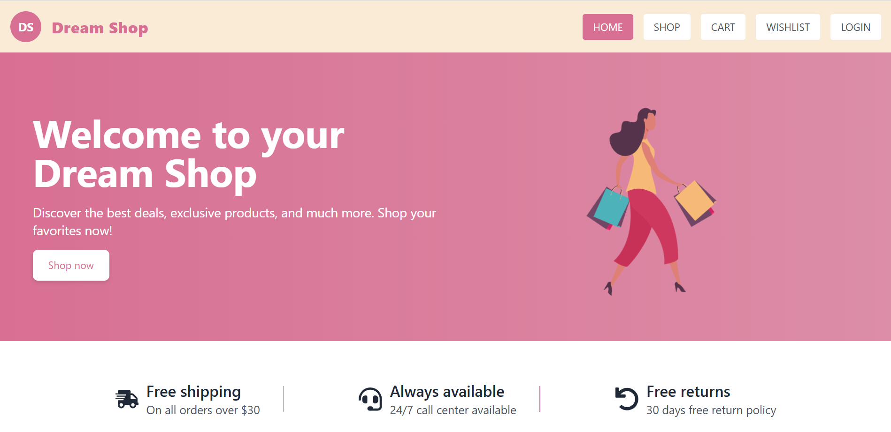
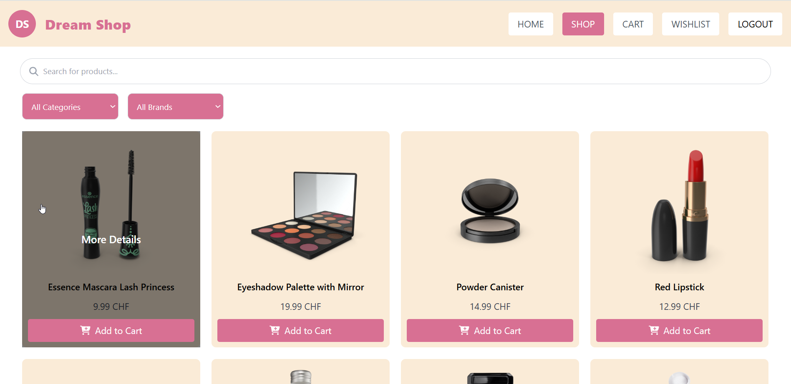

# Dream Shop
The online shop app "Dream Shop" is a simple and user-friendly e-commerce platform built with React. Users can browse, search, and filter products, view detailed descriptions, and add items to their cart or wishlist. Authentication features allow users to securely access protected pages like the cart and wishlist.

## Preview

## Tech Stack

- Frontend: JavaScript, React, React Redux, React Router, Toastify, Tailwind CSS
- Containerization: Docker
- Testing (e2e): Playwright 

## Features
- product search
- filtering products by brand and category
- navigation between pages (pagination)
- add/remove product to/from cart
- increase/decrease product quantity in the cart
- add/remove product to/from wishlist
- registration and login
- protected routes: cart and wishlist only accesible to authenticated users

## Installation & Setup

### Option 1: Run with Docker
#### Prerequisites:
- Docker Desktop installed locally

#### Run the following command to start the application:
  docker compose up

#### View the test report by running the following command:
  npx playwright show-report

### **Option 2: Install manually**
#### Install dependencies:
  npm install

#### Start the development server:
  npm run dev

#### Run E2E tests:
  npx playwright test

#### Generate and view the test report:  
  npx playwright show-report

## License
This project is licensed under the [MIT License](./LICENSE).